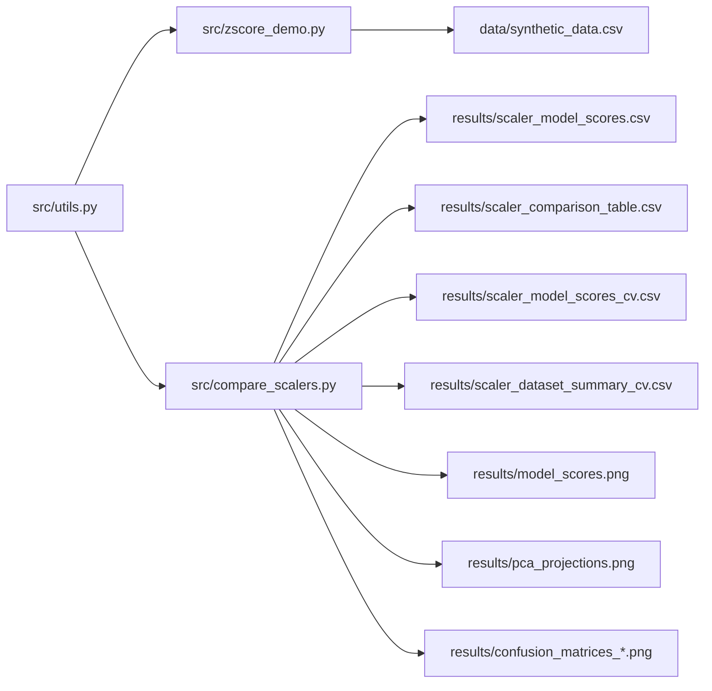

<!-- markdownlint-disable MD033 -->

# Z-Score Normalization in Machine Learning - Reproducible Comparative Study


This repository explains what z-score standardization is, where it belongs in modern ML workflow, and how it performs against min-max, robust scaling, and L2 normalization across multiple model families. The project is built to be practical and auditable: leakage-safe preprocessing, deterministic seeds, saved artifacts, and explicit cross-validation summaries.

The code now supports both a holdout benchmark and a repeated stratified cross-validation benchmark over two datasets, with confidence intervals and result tables saved to the results folder.

> [!IMPORTANT]
> Scaling is fit on training data only. Validation, test, and inference data are transformed using the already-fitted scaler.

## Table of Contents

- Project Scope
- Quick Scaler Guide
- Architecture
- ML Lifecycle Placement
- Logistic Regression and Z-Score
- Transformers and Attention Context
- Drift and Update Policy
- Experimental Protocol
- Results Snapshot
- How to Run
- Publishing and Contribution Files
- References

## Project Scope

The core mission is to compare preprocessing choices, not to chase a single leaderboard metric. Z-score often looks simple, but it directly changes optimization geometry, regularization balance, and neighborhood structure depending on the model.

| <sub>#</sub> | <sub>Topic</sub> | <sub>What This Repo Covers</sub> | <sub>What This Repo Does Not Cover</sub> | <sub>Why</sub> |
| --- | --- | --- | --- | --- |
| <sub>1</sub> | <sub>Preprocessing</sub> | <sub>Z-score, min-max, robust, L2 normalization</sub> | <sub>All advanced transforms</sub> | <sub>Keep comparison interpretable</sub> |
| <sub>2</sub> | <sub>Model Families</sub> | <sub>LR, KNN, SVM, RF, MLP</sub> | <sub>Large model zoo sweep</sub> | <sub>Show scaling sensitivity clearly</sub> |
| <sub>3</sub> | <sub>Validation</sub> | <sub>Holdout plus repeated stratified CV</sub> | <sub>Nested CV or Bayesian HPO</sub> | <sub>Strong baseline rigor with low complexity</sub> |
| <sub>4</sub> | <sub>Artifacts</sub> | <sub>CSV, score plot, PCA plot, confusion matrices</sub> | <sub>Interactive dashboards</sub> | <sub>Portable, versionable outputs</sub> |

> [!NOTE]
> This table defines the project boundary so readers know exactly what claims are supported by the current code.

## Quick Scaler Guide

| <sub>#</sub> | <sub>Scaler</sub> | <sub>Formula</sub> | <sub>Primary Use</sub> | <sub>Common Risk</sub> |
| --- | --- | --- | --- | --- |
| <sub>1</sub> | <sub>Z-Score</sub> | <sub>(x-mu)/sigma</sub> | <sub>General tabular ML default</sub> | <sub>Outlier-sensitive moments</sub> |
| <sub>2</sub> | <sub>Min-Max</sub> | <sub>(x-min)/(max-min)</sub> | <sub>Bounded range inputs</sub> | <sub>Extrema instability</sub> |
| <sub>3</sub> | <sub>Robust</sub> | <sub>(x-median)/IQR</sub> | <sub>Outlier-heavy features</sub> | <sub>Less direct variance interpretation</sub> |
| <sub>4</sub> | <sub>L2 Norm</sub> | <sub>x/norm2(x)</sub> | <sub>Directional similarity vectors</sub> | <sub>Weak on many raw tabular tasks</sub> |

> [!NOTE]
> This table is a fast decision view. It maps each transform to the problem it solves and the failure mode to watch.

The model-side sensitivity also differs substantially by algorithm family.

| <sub>#</sub> | <sub>Model</sub> | <sub>Sensitivity to Scaling</sub> | <sub>Main Reason</sub> | <sub>Expected Impact</sub> |
| --- | --- | --- | --- | --- |
| <sub>1</sub> | <sub>Logistic Regression</sub> | <sub>High</sub> | <sub>Regularization and gradients depend on feature magnitude</sub> | <sub>Large convergence and coefficient stability gains</sub> |
| <sub>2</sub> | <sub>KNN</sub> | <sub>Very High</sub> | <sub>Distance is the prediction rule</sub> | <sub>Strong metric changes likely</sub> |
| <sub>3</sub> | <sub>SVM RBF</sub> | <sub>High</sub> | <sub>Kernel distance geometry</sub> | <sub>Boundary quality changes</sub> |
| <sub>4</sub> | <sub>MLP</sub> | <sub>High</sub> | <sub>Optimization conditioning</sub> | <sub>Stability and performance changes</sub> |
| <sub>5</sub> | <sub>Random Forest</sub> | <sub>Low</sub> | <sub>Split thresholds mostly unit-invariant</sub> | <sub>Usually smaller differences</sub> |

> [!NOTE]
> This table explains why a single scaler can look excellent for one model and weak for another.

## Architecture



> [!NOTE]
> This diagram shows responsibility flow only. It avoids implementation details so project navigation remains simple.

| <sub>#</sub> | <sub>Component</sub> | <sub>Role</sub> | <sub>Outputs</sub> | <sub>Reason for Design</sub> |
| --- | --- | --- | --- | --- |
| <sub>1</sub> | <sub>src/utils.py</sub> | <sub>Core data, scaling, eval, plotting utilities</sub> | <sub>DataFrames, figures, CSV paths</sub> | <sub>Single source of benchmark logic</sub> |
| <sub>2</sub> | <sub>src/zscore_demo.py</sub> | <sub>Synthetic z-score walkthrough</sub> | <sub>data/synthetic_data.csv</sub> | <sub>Formula grounding before benchmarking</sub> |
| <sub>3</sub> | <sub>src/compare_scalers.py</sub> | <sub>Holdout plus repeated CV benchmark runner</sub> | <sub>All results CSV and plots</sub> | <sub>One command for reproducible artifacts</sub> |
| <sub>4</sub> | <sub>results/</sub> | <sub>Persisted experiment artifacts</sub> | <sub>Versionable benchmark evidence</sub> | <sub>Auditability and sharing</sub> |

> [!NOTE]
> This table describes architectural contracts so future contributors can extend the repo without breaking boundaries.

## ML Lifecycle Placement

Z-score is a preprocessing transform step, not a post-training report step. In supervised learning it should be fit after split creation and before model fitting. At inference it must use the exact training-fitted parameters.

| <sub>#</sub> | <sub>Lifecycle Stage</sub> | <sub>Z-Score Action</sub> | <sub>Allowed Operation</sub> | <sub>Failure if Wrong</sub> |
| --- | --- | --- | --- | --- |
| <sub>1</sub> | <sub>Data split</sub> | <sub>Define train/val/test boundaries</sub> | <sub>No fitting yet</sub> | <sub>Leakage risk if fit before split</sub> |
| <sub>2</sub> | <sub>Train preprocessing</sub> | <sub>Fit mu and sigma on train only</sub> | <sub>fit_transform train</sub> | <sub>Invalid benchmark if fit on all data</sub> |
| <sub>3</sub> | <sub>Validation/Test</sub> | <sub>Reuse trained scaler</sub> | <sub>transform only</sub> | <sub>Optimistic metrics if refit</sub> |
| <sub>4</sub> | <sub>Serving</sub> | <sub>Apply same scaler artifact</sub> | <sub>transform only</sub> | <sub>Train-serving skew</sub> |
| <sub>5</sub> | <sub>Retraining</sub> | <sub>Refit scaler on new train window</sub> | <sub>New fit after governance checks</sub> | <sub>Drift mismatch if stale scaler kept</sub> |

> [!NOTE]
> This table answers where z-score sits in ML workflow and when fitting is allowed.

## Logistic Regression and Z-Score

Logistic regression is usually one of the clearest beneficiaries of z-score on numeric tabular features. Scaling improves optimization conditioning and makes L1/L2 penalties operate on more comparable coefficient scales.

| <sub>#</sub> | <sub>Question</sub> | <sub>Answer</sub> | <sub>Practical Rule</sub> | <sub>Why</sub> |
| --- | --- | --- | --- | --- |
| <sub>1</sub> | <sub>When to scale for LR</sub> | <sub>Before model fitting</sub> | <sub>Use Pipeline with scaler then LR</sub> | <sub>Prevents leakage and keeps flow consistent</sub> |
| <sub>2</sub> | <sub>During training updates</sub> | <sub>Scaler params fixed per train run</sub> | <sub>Do not refit on validation batches</sub> | <sub>Stable optimization baseline</sub> |
| <sub>3</sub> | <sub>After training</sub> | <sub>No new fitting for evaluation</sub> | <sub>Transform-only on val/test</sub> | <sub>Metric validity</sub> |
| <sub>4</sub> | <sub>Under drift</sub> | <sub>Refit during retraining cycle</sub> | <sub>Version scaler with model</sub> | <sub>Distribution alignment</sub> |

> [!NOTE]
> This table directly addresses LR timing and operations for fit versus transform.

## Transformers and Attention Context

For many transformer systems, internal normalization layers (for example LayerNorm or RMSNorm) are part of model architecture, so external z-score is not automatically mandatory in the same way as classical tabular LR/KNN pipelines. For tabular transformer setups with heterogeneous numeric feature units, external feature scaling can still improve input stability.

| <sub>#</sub> | <sub>Context</sub> | <sub>External Z-Score Need</sub> | <sub>Primary Normalization Location</sub> | <sub>Guideline</sub> |
| --- | --- | --- | --- | --- |
| <sub>1</sub> | <sub>Classical tabular LR/KNN/SVM</sub> | <sub>Usually strong need</sub> | <sub>Input pipeline</sub> | <sub>Scale by default then validate</sub> |
| <sub>2</sub> | <sub>NLP transformer embeddings</sub> | <sub>Often low need</sub> | <sub>Inside model blocks</sub> | <sub>Follow model-native normalization path</sub> |
| <sub>3</sub> | <sub>Tabular transformer numeric inputs</sub> | <sub>Case-dependent</sub> | <sub>Both input and model layers</sub> | <sub>Benchmark with and without scaling</sub> |
| <sub>4</sub> | <sub>Production drift scenario</sub> | <sub>Needs governance</sub> | <sub>Pipeline versioning</sub> | <sub>Revalidate normalization assumptions</sub> |

> [!NOTE]
> This table clarifies how transformer-era methods change normalization defaults without removing the need for tabular preprocessing discipline.

## Drift and Update Policy

| <sub>#</sub> | <sub>Observed Signal</sub> | <sub>Likely Cause</sub> | <sub>Action</sub> | <sub>Verification</sub> |
| --- | --- | --- | --- | --- |
| <sub>1</sub> | <sub>Feature mean shift</sub> | <sub>Covariate drift</sub> | <sub>Retrain and refit scaler</sub> | <sub>Compare holdout and CV deltas</sub> |
| <sub>2</sub> | <sub>Variance regime change</sub> | <sub>Sensor or source change</sub> | <sub>Refit scaler and rerun CI benchmark</sub> | <sub>Check CI overlap and confusion matrices</sub> |
| <sub>3</sub> | <sub>Sudden serving metric drop</sub> | <sub>Train-serving preprocessing mismatch</sub> | <sub>Audit scaler artifact parity</sub> | <sub>Reproduce with frozen artifacts</sub> |
| <sub>4</sub> | <sub>Class balance shift</sub> | <sub>Population change</sub> | <sub>Re-split stratified sets and retrain</sub> | <sub>Monitor per-class confusion changes</sub> |

> [!NOTE]
> This table converts drift theory into operational actions and checks.

## Experimental Protocol

The repository executes two evaluation tracks: a holdout track for diagnostics and a repeated stratified CV track for uncertainty-aware comparison.

| <sub>#</sub> | <sub>Track</sub> | <sub>Protocol</sub> | <sub>Datasets</sub> | <sub>Main Output</sub> |
| --- | --- | --- | --- | --- |
| <sub>1</sub> | <sub>Holdout</sub> | <sub>Single stratified split</sub> | <sub>breast_cancer</sub> | <sub>per-model scores plus plots</sub> |
| <sub>2</sub> | <sub>Repeated CV</sub> | <sub>5 folds x 5 repeats, stratified</sub> | <sub>breast_cancer and wine</sub> | <sub>mean, std, 95 percent CI</sub> |

> [!NOTE]
> This table states exactly what is computed so reported claims stay aligned with actual code behavior.

The CI formula used in the project is shown below.

$$
\bar{x} \pm 1.96 \cdot \frac{s}{\sqrt{n}}
$$

> [!NOTE]
> Here, $\bar{x}$ is mean CV accuracy, $s$ is sample standard deviation across splits, and $n$ is number of split scores.

## Results Snapshot

Holdout summary from current run:

| <sub>#</sub> | <sub>Scaler</sub> | <sub>Mean Accuracy</sub> | <sub>Rank</sub> | <sub>Interpretation</sub> |
| --- | --- | --- | --- | --- |
| <sub>1</sub> | <sub>robust</sub> | <sub>0.9684</sub> | <sub>1</sub> | <sub>Strong with mild outlier robustness</sub> |
| <sub>2</sub> | <sub>zscore</sub> | <sub>0.9667</sub> | <sub>2</sub> | <sub>Near-best general baseline</sub> |
| <sub>3</sub> | <sub>minmax</sub> | <sub>0.9632</sub> | <sub>3</sub> | <sub>Competitive but slightly lower average</sub> |
| <sub>4</sub> | <sub>l2_norm</sub> | <sub>0.9018</sub> | <sub>4</sub> | <sub>Weaker for this tabular task setup</sub> |

> [!NOTE]
> This table is the holdout summary only. Use the CV summary for stronger uncertainty-aware comparison.

Repeated CV cross-dataset scaler summary from current run:

| <sub>#</sub> | <sub>Dataset</sub> | <sub>Best Scaler</sub> | <sub>Best Mean Across Models</sub> | <sub>Lowest Scaler</sub> |
| --- | --- | --- | --- | --- |
| <sub>1</sub> | <sub>breast_cancer</sub> | <sub>zscore</sub> | <sub>0.9705</sub> | <sub>l2_norm at 0.8944</sub> |
| <sub>2</sub> | <sub>wine</sub> | <sub>zscore</sub> | <sub>0.9804</sub> | <sub>l2_norm at 0.7826</sub> |

> [!NOTE]
> This table shows that z-score is the top mean scorer across both datasets in repeated CV summary, while L2 normalization is lowest in this benchmark configuration.

## How to Run

```bash
python3 -m venv .venv
source .venv/bin/activate
pip install -r requirements.txt
python src/zscore_demo.py
python src/compare_scalers.py
```

| <sub>#</sub> | <sub>Command</sub> | <sub>Primary Effect</sub> | <sub>Expected Output Files</sub> | <sub>Run Time Profile</sub> |
| --- | --- | --- | --- | --- |
| <sub>1</sub> | <sub>python src/zscore_demo.py</sub> | <sub>Generate synthetic z-score demo data</sub> | <sub>data/synthetic_data.csv</sub> | <sub>Short</sub> |
| <sub>2</sub> | <sub>python src/compare_scalers.py</sub> | <sub>Run holdout plus repeated CV benchmark</sub> | <sub>results/*.csv and results/*.png</sub> | <sub>Moderate</sub> |

> [!NOTE]
> Run from project root so relative output paths match repository structure.

## Publishing and Contribution Files

| <sub>#</sub> | <sub>File</sub> | <sub>Purpose</sub> | <sub>Who Uses It</sub> | <sub>Status</sub> |
| --- | --- | --- | --- | --- |
| <sub>1</sub> | <sub>LICENSE</sub> | <sub>Legal reuse terms</sub> | <sub>All users</sub> | <sub>Added</sub> |
| <sub>2</sub> | <sub>CONTRIBUTING.md</sub> | <sub>Contribution workflow</sub> | <sub>Contributors</sub> | <sub>Added</sub> |
| <sub>3</sub> | <sub>.github/ISSUE_TEMPLATE/bug_report.md</sub> | <sub>Bug intake template</sub> | <sub>Issue reporters</sub> | <sub>Added</sub> |
| <sub>4</sub> | <sub>.github/ISSUE_TEMPLATE/feature_request.md</sub> | <sub>Feature intake template</sub> | <sub>Issue reporters</sub> | <sub>Added</sub> |
| <sub>5</sub> | <sub>.github/pull_request_template.md</sub> | <sub>PR quality checklist</sub> | <sub>Contributors and reviewers</sub> | <sub>Added</sub> |
| <sub>6</sub> | <sub>.github/RELEASE_CHECKLIST.md</sub> | <sub>Release gate checks</sub> | <sub>Maintainers</sub> | <sub>Added</sub> |

> [!NOTE]
> This table confirms repository publishing hygiene is in place for public collaboration.

## References

| <sub>#</sub> | <sub>Type</sub> | <sub>Source</sub> | <sub>Why It Is Included</sub> | <sub>Link</sub> |
| --- | --- | --- | --- | --- |
| <sub>1</sub> | <sub>Documentation</sub> | <sub>scikit-learn preprocessing guide</sub> | <sub>Transformer definitions and API semantics</sub> | <sub>https://scikit-learn.org/stable/modules/preprocessing.html</sub> |
| <sub>2</sub> | <sub>Documentation</sub> | <sub>scikit-learn scaling example</sub> | <sub>Practical effect of scaling on models and PCA</sub> | <sub>https://scikit-learn.org/stable/auto_examples/preprocessing/plot_scaling_importance.html</sub> |
| <sub>3</sub> | <sub>arXiv</sub> | <sub>Ioffe and Szegedy 2015</sub> | <sub>Normalization and optimization context</sub> | <sub>https://arxiv.org/abs/1502.03167</sub> |
| <sub>4</sub> | <sub>arXiv</sub> | <sub>Santurkar et al 2018</sub> | <sub>Why normalization can help optimization</sub> | <sub>https://arxiv.org/abs/1805.11604</sub> |
| <sub>5</sub> | <sub>arXiv</sub> | <sub>Kapoor and Narayanan 2022</sub> | <sub>Leakage and reproducibility context</sub> | <sub>https://arxiv.org/abs/2207.07048</sub> |
| <sub>6</sub> | <sub>Article</sub> | <sub>Singh and Singh 2020</sub> | <sub>Comparative normalization impact evidence</sub> | <sub>https://www.sciencedirect.com/science/article/pii/S1568494619302947</sub> |

> [!NOTE]
> These references anchor both implementation choices and methodological claims.

## Final Accuracy Statement

This README is aligned with current code and outputs in this repository, including MLP, PCA projections, confusion matrices, repeated stratified CV, confidence interval tables, second dataset comparison, and GitHub publishing files.

If behavior changes in source scripts, update this README in the same change set to preserve truthfulness and reproducibility.
