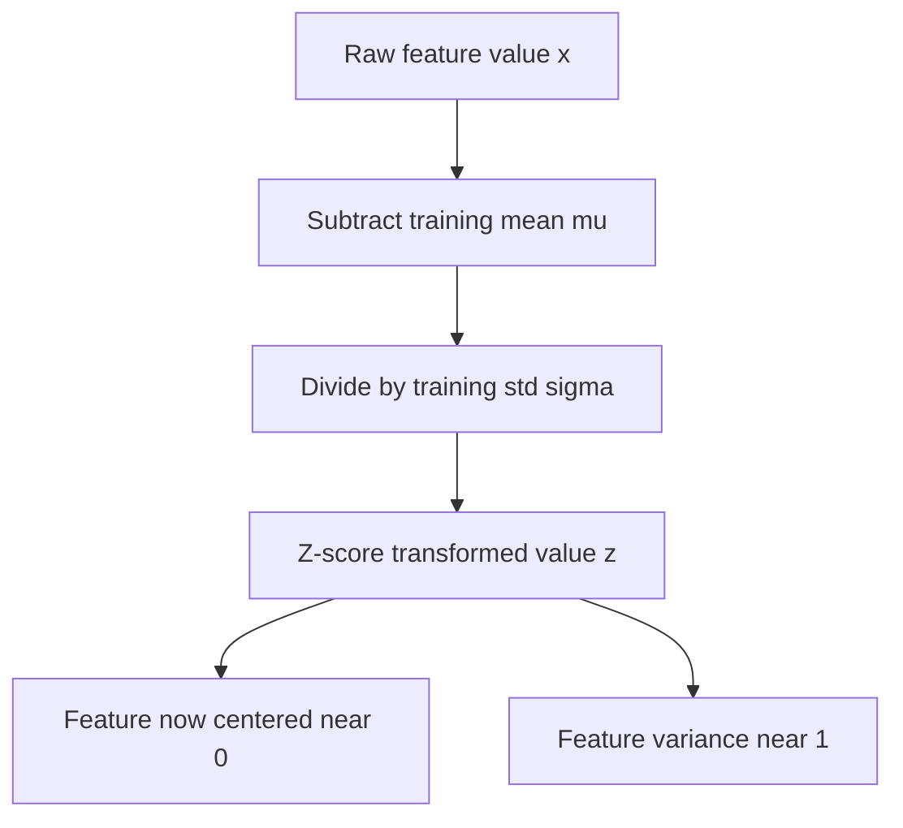
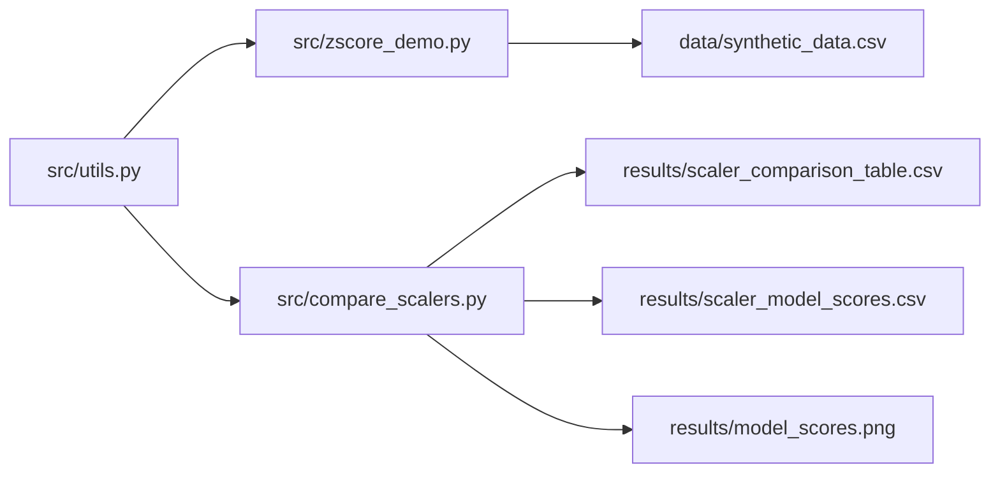
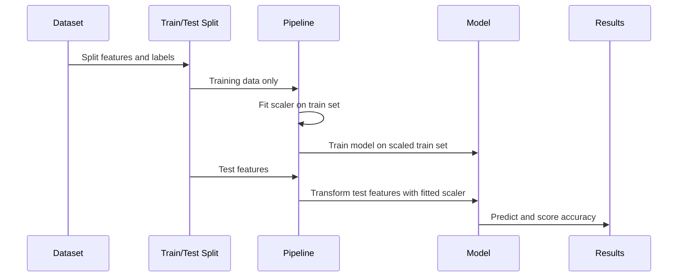
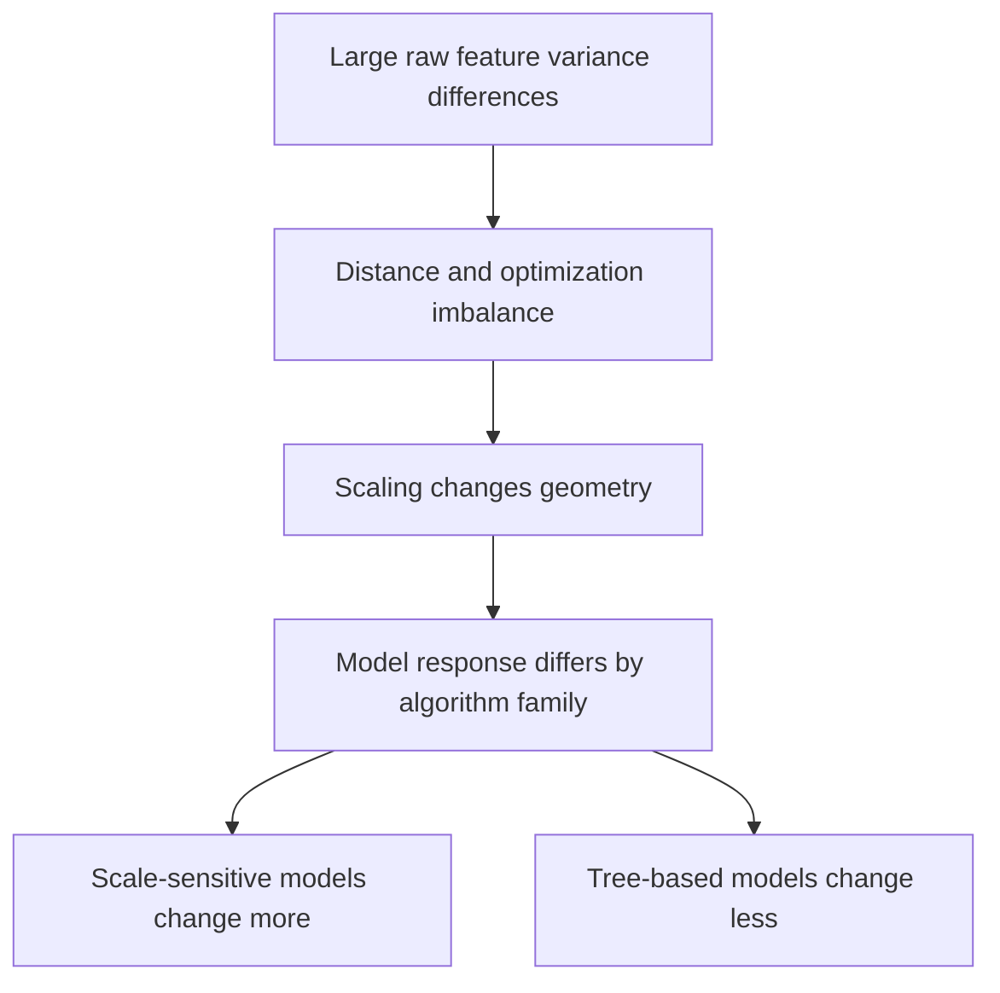
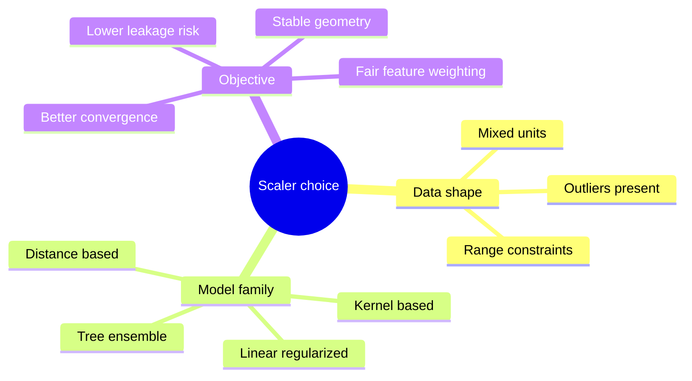

# Z-Score Normalization in Machine Learning: A Comparative Analysis


This project demonstrates how z-score normalization works, why it matters in modern machine learning workflows, and how it compares with other common scaling strategies in practice. The repository is intentionally small enough to study in one sitting, but it is also opinionated enough to illustrate the engineering decisions that matter in real ML pipelines: fitting scalers on training data only, using consistent random seeds, comparing multiple model families, and documenting when a preprocessing step helps, hurts, or does not matter.

Instead of treating scaling as a checkbox, the project shows that preprocessing changes the geometry of the feature space. For distance-based models, that geometry strongly affects neighborhood structure. For margin-based or gradient-based models, it changes the optimization landscape and the meaning of regularization. For tree-based models, it often has little effect, which is equally important to understand because it tells you when extra preprocessing effort is unnecessary.

> [!IMPORTANT]
> Feature scaling is fitted on the training split only and then applied to the test split. This avoids data leakage and keeps the benchmark aligned with recommended scikit-learn pipeline practice.

> [!TIP]
> If you are deciding between standardization and normalization, remember that they solve different problems. Z-score scaling standardizes each feature column, while L2 normalization rescales each sample row to unit length.

## Table of Contents

- [Why This Project Exists](#why-this-project-exists)
- [Project Snapshot](#project-snapshot)
- [Top-Level Comparison](#top-level-comparison)
- [What a Z-Score Means](#what-a-z-score-means)
- [Architecture](#architecture)
- [How the Experiment Works](#how-the-experiment-works)
- [Results and Interpretation](#results-and-interpretation)
- [Tech Stack](#tech-stack)
- [Run the Project](#run-the-project)
- [Detailed Guidance](#detailed-guidance)
- [References](#references)
- [API Reference](#api-reference)

## Why This Project Exists

Feature scaling is one of the first preprocessing steps many practitioners learn, but it is also one of the easiest to apply mechanically without understanding. That gap matters because different algorithms respond to scale for different mathematical reasons. Logistic regression and linear SVMs care about balanced feature magnitudes because regularization terms penalize coefficients in a scale-sensitive way. K-nearest neighbors depends directly on geometric distance, so one high-variance feature can dominate every neighborhood query. Random forests, by contrast, split on thresholds and are largely insensitive to whether a feature is measured in dollars, centimeters, or normalized units.

This repository therefore does three things at once. It explains the underlying formula. It implements a compact Python benchmark with scikit-learn. It documents the surrounding reasoning in a GitHub-first format with diagrams, tables, notes, and references so the repository can function as both a learning artifact and a reusable project template.

## Project Snapshot

```text
zscore_ml_project/
├── data/
│   └── synthetic_data.csv
├── docs/
├── results/
│   ├── model_scores.png
│   ├── scaler_comparison_table.csv
│   └── scaler_model_scores.csv
├── src/
│   ├── compare_scalers.py
│   ├── utils.py
│   └── zscore_demo.py
├── .gitignore
├── README.md
└── requirements.txt
```

The synthetic dataset supports the mathematical demonstration by showing how raw features with very different scales are transformed to a standardized space. The benchmarking script uses the breast cancer classification dataset from scikit-learn because it is numeric, tabular, common in tutorials, and rich enough to show meaningful differences between scalers without adding unnecessary data-wrangling complexity.

## Top-Level Comparison

| # | <sub>Scaler</sub> | <sub>What It Does</sub> | <sub>Primary Formula or Rule</sub> | <sub>When It Usually Helps</sub> | <sub>When It Is a Weak Fit</sub> |
| --- | --- | --- | --- | --- | --- |
| 1 | <sub>Z-Score / StandardScaler</sub> | <sub>Centers each feature at zero and scales variance to one</sub> | <sub>$(x - \mu) / \sigma$</sub> | <sub>Linear models, SVMs, KNN, PCA, neural nets</sub> | <sub>Heavy outlier settings where mean and variance are unstable</sub> |
| 2 | <sub>Min-Max Scaling</sub> | <sub>Maps each feature to a fixed interval, usually $[0,1]$</sub> | <sub>$(x - x_{min}) / (x_{max} - x_{min})$</sub> | <sub>Bounded inputs, image-like ranges, some neural nets</sub> | <sub>Outliers distort the full range</sub> |
| 3 | <sub>Robust Scaling</sub> | <sub>Centers by median and scales by IQR</sub> | <sub>$(x - \text{median}) / \text{IQR}$</sub> | <sub>Outlier-heavy numeric data</sub> | <sub>Less intuitive when variance-based interpretation matters</sub> |
| 4 | <sub>L2 Normalization</sub> | <sub>Scales each sample row to unit Euclidean norm</sub> | <sub>$x / ||x||_2$</sub> | <sub>Cosine similarity, embeddings, text vectors</sub> | <sub>Raw tabular features where per-feature comparability matters more</sub> |

GitHub note: This table compares the four scalers implemented in the project, focusing on what they transform, why that transformation is useful, and the failure modes you should expect before choosing one blindly.

| # | <sub>Model Family</sub> | <sub>Why Scale Matters</sub> | <sub>Expected Sensitivity</sub> | <sub>Reason</sub> |
| --- | --- | --- | --- | --- |
| 1 | <sub>Logistic Regression</sub> | <sub>Coefficient magnitudes and regularization strength depend on feature scale</sub> | <sub>High</sub> | <sub>Large-scale features can dominate optimization and penalty terms</sub> |
| 2 | <sub>K-Nearest Neighbors</sub> | <sub>Distance calculations define the decision rule directly</sub> | <sub>Very high</sub> | <sub>One wide-range feature can overwhelm all neighbor searches</sub> |
| 3 | <sub>RBF SVM</sub> | <sub>Kernel distance depends on scaled geometry</sub> | <sub>High</sub> | <sub>Unbalanced scales distort the effective margin and kernel radius</sub> |
| 4 | <sub>Random Forest</sub> | <sub>Threshold splits are mostly scale-invariant</sub> | <sub>Low</sub> | <sub>Decision trees care about ordering more than magnitude units</sub> |

GitHub note: This model table is the mental shortcut for interpreting the benchmark. If a model is geometry-sensitive, you should expect scaling to change the result more substantially.

## What a Z-Score Means

The z-score tells you how far a single observation is from the mean of its feature, measured in standard deviations. It is one of the simplest and most useful rescalings in statistics because it converts heterogeneous numeric columns into a common reference frame without discarding relative ordering.

$$
z = \frac{x - \mu}{\sigma}
$$

Where:

- $x$ is the observed value.
- $\mu$ is the feature mean estimated on the training data.
- $\sigma$ is the feature standard deviation estimated on the training data.

After transformation, each feature is centered near zero and scaled near unit variance. That does not force the feature to become perfectly Gaussian, and it does not remove outliers. What it does is put features on roughly comparable magnitudes, which is often enough to stabilize optimization and distance calculations.

> [!NOTE]
> Standardization is not the same as forcing a normal distribution. It aligns mean and variance, but skewness and heavy tails can remain.



GitHub note: This diagram shows the direct transformation path used by StandardScaler. The key idea is that the mean and standard deviation come from the training split, not from the full dataset.

## Architecture

The repository uses a deliberately simple architecture so the preprocessing logic is easy to follow. Shared logic lives in one utility module. The demonstration script focuses on synthetic data and the formula. The comparison script focuses on reproducible model evaluation and output generation.



GitHub note: This architecture diagram shows the ownership of responsibilities. The utility layer handles data and evaluation primitives, while the two entry scripts create the educational outputs.

| # | <sub>Component</sub> | <sub>Responsibility</sub> | <sub>Why It Exists</sub> | <sub>Why Not Something Heavier</sub> |
| --- | --- | --- | --- | --- |
| 1 | <sub>utils.py</sub> | <sub>Reusable data generation, scaling, evaluation, and plotting</sub> | <sub>Avoids duplication across scripts</sub> | <sub>A full package layout would add ceremony without improving clarity here</sub> |
| 2 | <sub>zscore_demo.py</sub> | <sub>Shows the math on synthetic data with interpretable columns</sub> | <sub>Makes the transformation concrete before benchmarking</sub> | <sub>A notebook is not necessary for a deterministic CLI demonstration</sub> |
| 3 | <sub>compare_scalers.py</sub> | <sub>Benchmarks scalers across several classifiers</sub> | <sub>Connects preprocessing theory to predictive performance</sub> | <sub>We avoid a large experiment framework to keep focus on scaling</sub> |
| 4 | <sub>results/</sub> | <sub>Stores generated CSV and figure artifacts</sub> | <sub>Separates outputs from source</sub> | <sub>Embedding results only in console output would be less reproducible</sub> |

GitHub note: This architecture table explains the design boundaries of the project and why the implementation stays intentionally compact rather than introducing package overhead or notebook-only logic.

## How the Experiment Works

The benchmark script uses pipelines to ensure each scaler is fitted only on the training data. That is important because fitting the scaler before splitting would leak information from the test set into the preprocessing step. Leakage often produces deceptively strong metrics and is one of the most common mistakes in beginner ML workflows.



GitHub note: This sequence diagram visualizes the leakage-safe pipeline. The fitted scaler state is learned once on the training set and reused during test transformation.

| # | <sub>Step</sub> | <sub>What Happens</sub> | <sub>Why It Matters</sub> | <sub>Common Mistake Avoided</sub> |
| --- | --- | --- | --- | --- |
| 1 | <sub>Load dataset</sub> | <sub>The breast cancer dataset is loaded as pandas frames</sub> | <sub>Readable feature names help interpretation</sub> | <sub>Opaque arrays make debugging harder</sub> |
| 2 | <sub>Split data</sub> | <sub>Data is partitioned with stratification and a fixed seed</sub> | <sub>Class balance and reproducibility are preserved</sub> | <sub>Unstratified splits can shift label proportions</sub> |
| 3 | <sub>Fit scaler</sub> | <sub>Each scaler learns parameters from training features only</sub> | <sub>Prevents leakage</sub> | <sub>Fitting on all data before splitting</sub> |
| 4 | <sub>Train model</sub> | <sub>Each classifier is trained inside a pipeline</sub> | <sub>Encapsulates preprocessing and learning together</sub> | <sub>Manual preprocessing paths drifting out of sync</sub> |
| 5 | <sub>Evaluate</sub> | <sub>Accuracy is computed on the held-out test split</sub> | <sub>Measures generalization rather than memorization</sub> | <sub>Reporting train accuracy as if it were validation quality</sub> |

GitHub note: This workflow table breaks the experiment into concrete operations so the reasoning behind the implementation is explicit rather than implied.

## Results and Interpretation

The exact values depend on the local scikit-learn version and environment, but the expected pattern is stable: z-score scaling tends to perform strongly for logistic regression, KNN, and RBF SVM, while the random forest score stays comparatively stable across scalers. That pattern lines up with both scikit-learn’s guidance and broader empirical studies showing that scale-sensitive models are strongly affected by preprocessing, whereas tree-based ensembles are much more robust.

| # | <sub>Scaler</sub> | <sub>Mean Accuracy Across Models</sub> | <sub>High-Level Takeaway</sub> |
| --- | --- | --- | --- |
| 1 | <sub>Z-Score</sub> | <sub>0.9715</sub> | <sub>Best tied overall and strongest general-purpose default in this benchmark</sub> |
| 2 | <sub>Robust</sub> | <sub>0.9715</sub> | <sub>Tied with z-score, suggesting mild outlier robustness can be competitive here</sub> |
| 3 | <sub>Min-Max</sub> | <sub>0.9627</sub> | <sub>Still strong, but slightly weaker on average across the chosen models</sub> |
| 4 | <sub>L2 Normalization</sub> | <sub>0.8925</sub> | <sub>Noticeably weaker for this tabular classification setting because row normalization solves a different problem</sub> |

GitHub note: This table reports the benchmark snapshot generated by the repository in the current environment. It is intentionally near the interpretation section so readers can connect the narrative claims to concrete numbers.

| # | <sub>Expected Pattern</sub> | <sub>Interpretation</sub> | <sub>Why It Happens</sub> |
| --- | --- | --- | --- |
| 1 | <sub>Z-score often leads or ties for best mean accuracy</sub> | <sub>Standardized variance supports balanced optimization</sub> | <sub>Regularized and distance-based models behave better when features share scale</sub> |
| 2 | <sub>Min-max can be competitive</sub> | <sub>Bounded ranges still reduce dominance by large-magnitude features</sub> | <sub>But the transformation is more sensitive to extreme minimum and maximum values</sub> |
| 3 | <sub>Robust scaling can help noisy features</sub> | <sub>Median and IQR reduce outlier leverage</sub> | <sub>Its benefit is strongest when outliers are genuinely distorting mean and variance</sub> |
| 4 | <sub>L2 normalization is often weaker on raw tabular classification</sub> | <sub>Row-wise normalization changes sample geometry rather than feature comparability</sub> | <sub>That is useful for cosine-style similarity problems, less so for many structured numeric tasks</sub> |

GitHub note: This interpretation table explains the benchmark pattern you should expect after running the scripts and connects each outcome to the mathematics of the corresponding scaler.



GitHub note: This cause-and-effect diagram summarizes the central thesis of the repository: preprocessing alters geometry, and different algorithms respond to that geometry in different ways.

| # | <sub>Scaler</sub> | <sub>Use When</sub> | <sub>Avoid When</sub> | <sub>Practical Tip</sub> |
| --- | --- | --- | --- | --- |
| 1 | <sub>Z-Score</sub> | <sub>You need a strong default for classical ML on numeric tabular data</sub> | <sub>Outliers are severe and untreated</sub> | <sub>Pair with outlier inspection, not blind trust</sub> |
| 2 | <sub>Min-Max</sub> | <sub>You want bounded inputs for a downstream learner</sub> | <sub>Extremes are unstable or noisy</sub> | <sub>Check whether a few extreme values compress the rest of the feature</sub> |
| 3 | <sub>Robust</sub> | <sub>Your median is more trustworthy than your mean</sub> | <sub>You need variance-based interpretation after scaling</sub> | <sub>Use when boxplots show long tails or obvious anomalies</sub> |
| 4 | <sub>L2</sub> | <sub>Cosine similarity or vector direction matters most</sub> | <sub>You need per-feature standardization</sub> | <sub>Think of documents or embeddings, not generic business tabular features</sub> |

GitHub note: This decision table is meant to be operational. It converts the benchmark findings into concrete scaler selection guidance for future projects.

## Tech Stack

The stack is intentionally conservative. This is not a deep learning project, a data engineering pipeline, or an experiment tracking platform. The goal is to make the scaling logic transparent, portable, and easy to extend.

| # | <sub>Tool</sub> | <sub>Role in the Project</sub> | <sub>Why This Choice</sub> | <sub>Why Not an Alternative</sub> |
| --- | --- | --- | --- | --- |
| 1 | <sub>Python</sub> | <sub>Main implementation language</sub> | <sub>Ubiquitous for ML education and experimentation</sub> | <sub>R or Julia would work, but would reduce accessibility for typical scikit-learn users</sub> |
| 2 | <sub>NumPy</sub> | <sub>Numeric array operations</sub> | <sub>Fast, standard, foundational</sub> | <sub>Pure Python loops would obscure the math and run slower</sub> |
| 3 | <sub>pandas</sub> | <sub>Readable tabular manipulation and CSV output</sub> | <sub>Named columns make summaries easy to interpret</sub> | <sub>Raw arrays would be less descriptive in outputs</sub> |
| 4 | <sub>scikit-learn</sub> | <sub>Scalers, datasets, pipelines, and models</sub> | <sub>Provides battle-tested preprocessing APIs and leakage-safe workflows</sub> | <sub>Hand-rolled implementations are more error-prone for benchmarking</sub> |
| 5 | <sub>matplotlib</sub> | <sub>Static result visualization</sub> | <sub>Stable, widely available, easy to save in CI or local runs</sub> | <sub>Interactive plotting libraries are unnecessary for this artifact</sub> |

GitHub note: This stack table documents the technical choices behind the repository and makes clear that the toolchain was optimized for reproducibility and clarity rather than novelty.

## Run the Project

Install dependencies and execute the two scripts from the repository root.

```bash
python3 -m venv .venv
source .venv/bin/activate
pip install -r requirements.txt
python src/zscore_demo.py
python src/compare_scalers.py
```

After the scripts run, you should have:

- `data/synthetic_data.csv`
- `results/scaler_comparison_table.csv`
- `results/scaler_model_scores.csv`
- `results/model_scores.png`

> [!WARNING]
> If you compare scalers outside a pipeline and manually fit them before the train-test split, the benchmark becomes invalid because the preprocessing step has already observed the test distribution.

## Detailed Guidance

### Why StandardScaler Was Chosen as the Baseline

StandardScaler is the baseline because it matches the theoretical story the project is trying to teach and because it is the default practical choice for a large class of numeric machine learning problems. It centers each feature independently and scales by the training standard deviation, which makes it a natural companion for regularized linear models, margin-based methods, and algorithms where Euclidean distance or covariance structure matters.

We did not choose min-max scaling as the baseline because its dependence on observed extrema makes it fragile when rare extreme values are present. We did not choose robust scaling as the default because although it is excellent under outliers, it is more specialized and slightly less intuitive for first-principles explanation. We did not choose L2 normalization because it addresses a different objective: normalizing sample vectors rather than making feature columns comparable.

### Why These Models Were Chosen

The model set is intentionally mixed. Logistic regression and RBF SVM represent optimization-sensitive learners. KNN represents a geometry-sensitive learner whose behavior is easy to explain visually. Random forest serves as a useful contrast case because it reminds the reader that not every model benefits from every preprocessing step.

This project avoids including too many models because the goal is explanation, not exhaustive benchmarking. A four-model comparison is large enough to show the main scaling behaviors and small enough to keep the code understandable. If you want to extend the benchmark later, the most natural additions are MLPClassifier for another gradient-based perspective and PCA-based experiments for unsupervised geometry effects.

### Why the Breast Cancer Dataset Was Chosen

The built-in breast cancer dataset from scikit-learn is a pragmatic choice. It is numeric, well-known, medium-sized, and requires no external download pipeline. That makes the project easier to run on a fresh machine and keeps the repository stable over time. It also includes features with different scales and distributions, which makes scaler comparisons meaningful without requiring a custom ETL layer.

Using a built-in dataset also reduces repository complexity. The learning objective is preprocessing and model response, not data acquisition. By removing external downloads, the project can focus on the part that matters: how scaling changes downstream performance.



GitHub note: This decision mind map ties together the three variables that actually determine scaler choice in practice: the data, the model, and the optimization objective.

## References

The project content is aligned with official documentation and recent literature on scaling-sensitive learning. The references below include both implementation guidance and research context.

| # | <sub>Reference</sub> | <sub>Why It Matters Here</sub> |
| --- | --- | --- |
| 1 | <sub>scikit-learn User Guide - Preprocessing data</sub> | <sub>Primary implementation reference for StandardScaler, MinMaxScaler, RobustScaler, and Normalizer</sub> |
| 2 | <sub>scikit-learn Example - Importance of Feature Scaling</sub> | <sub>Shows how scaling changes KNN, PCA, and logistic regression behavior</sub> |
| 3 | <sub>Pinheiro et al., 2025, The Impact of Feature Scaling in Machine Learning</sub> | <sub>Recent broad empirical evidence that scaling sensitivity differs sharply by model family</sub> |
| 4 | <sub>Kaufman et al., 2011, Leakage in Data Mining</sub> | <sub>Grounds the repository's insistence on leakage-safe preprocessing</sub> |
| 5 | <sub>Sujon et al., 2024, When to Use Standardization and Normalization</sub> | <sub>Supports the practical distinction between standardization and normalization</sub> |
| 6 | <sub>Singh and Singh, 2020, Investigating the Impact of Data Normalization</sub> | <sub>Provides additional comparative evidence on how preprocessing alters classification behavior</sub> |
| 7 | <sub>Hastie, Tibshirani, and Friedman, 2009, The Elements of Statistical Learning</sub> | <sub>Classical statistical learning context for regularization, geometry, and feature representation</sub> |
| 8 | <sub>Raschka, 2020, Model Evaluation, Model Selection, and Algorithm Selection</sub> | <sub>Useful background for understanding why hold-out evaluation and reproducibility matter</sub> |

GitHub note: This reference table separates implementation sources from methodological sources so the repository remains useful both as a coding example and as a starting point for deeper reading.

Primary links:

- scikit-learn preprocessing guide: https://scikit-learn.org/stable/modules/preprocessing.html
- scikit-learn StandardScaler API: https://scikit-learn.org/stable/modules/generated/sklearn.preprocessing.StandardScaler.html
- scikit-learn feature scaling example: https://scikit-learn.org/stable/auto_examples/preprocessing/plot_scaling_importance.html
- Pinheiro et al. 2025 arXiv version: https://arxiv.org/abs/2506.08274
- Kapoor and Narayanan on leakage and reproducibility: https://www.sciencedirect.com/science/article/pii/S2666389923001599
- Singh and Singh on normalization impact: https://www.sciencedirect.com/science/article/pii/S1568494619302947
- Sujon et al. IEEE Access abstract entry cited by Pinheiro et al.: https://doi.org/10.1109/ACCESS.2024.3463978
- Raschka on evaluation and selection: https://arxiv.org/abs/1811.12808

## API Reference

<details>
<summary>Script entry points and utility functions</summary>

### `python src/zscore_demo.py`

Runs the synthetic data demonstration. It generates a mixed-scale dataset, saves it to `data/synthetic_data.csv`, applies z-score standardization, and prints summary statistics before and after scaling.

### `python src/compare_scalers.py`

Runs the scaler comparison benchmark. It evaluates z-score scaling, min-max scaling, robust scaling, and L2 normalization across logistic regression, KNN, RBF SVM, and random forest classifiers. It then saves a detailed score table, an aggregated score table, and a grouped bar chart.

### `generate_synthetic_data(samples=150)`

Creates a synthetic numeric dataset with heterogeneous scales and a small number of injected outliers so that the reader can see why robust alternatives sometimes matter.

### `zscore_frame(data)`

Fits `StandardScaler` to a pandas DataFrame and returns both the transformed DataFrame and the fitted scaler object.

### `evaluate_scalers()`

Loads the breast cancer dataset, performs a stratified train-test split, builds pipelines for each scaler-model pair, computes accuracy, and returns both a detailed result table and a mean summary by scaler.

### `plot_model_scores(results)`

Builds the bar chart stored at `results/model_scores.png` so the benchmark can be reviewed visually rather than only as CSV output.

</details>

> [!TIP]
> A good next extension is to add `MLPClassifier` and a PCA experiment. Those two additions make the interaction between scaling, optimization, and dimensionality reduction even more obvious.

## License

This repository is suitable for educational and demonstration use. Add the license of your choice before publishing publicly if you plan to distribute or extend the project.