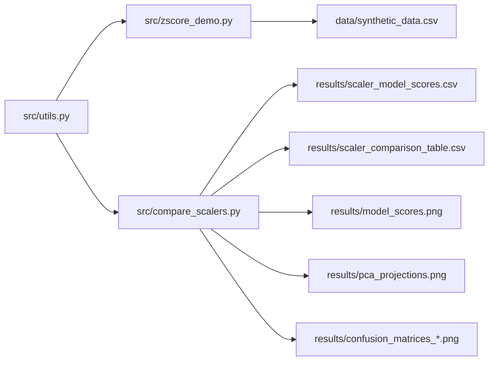
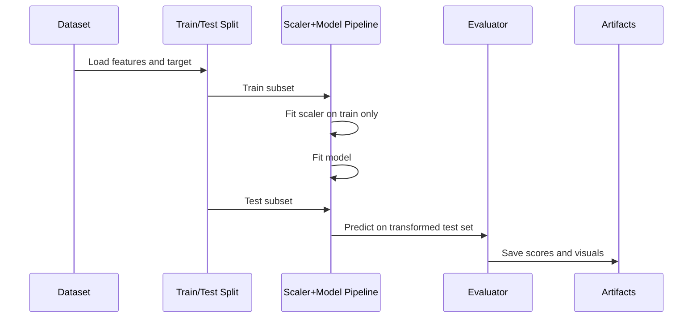
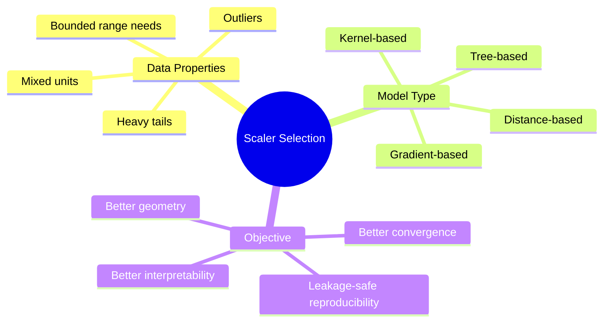
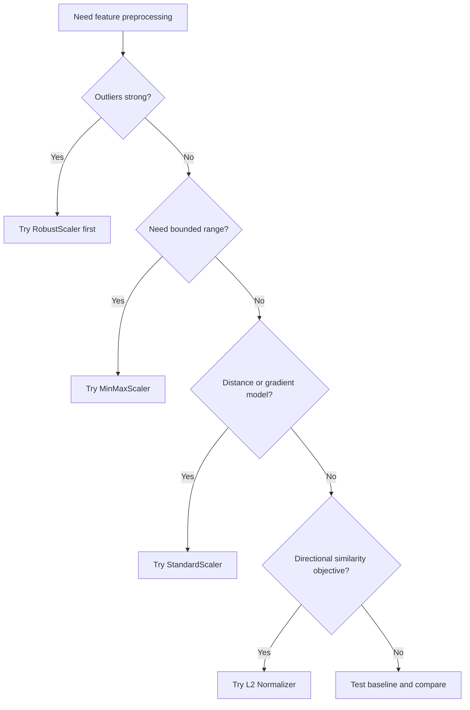
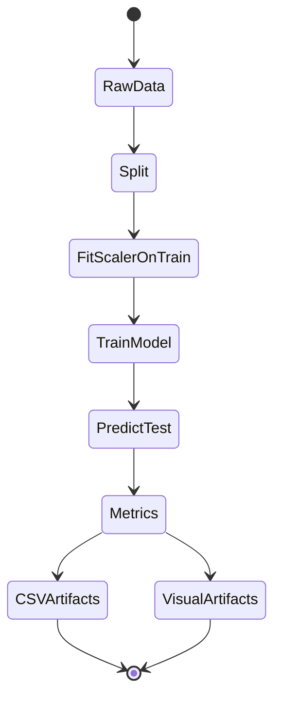

# Z-Score Normalization in Machine Learning: End-to-End Comparative Study


This repository is a practical, reproducible study of feature scaling for tabular machine learning. It does not treat normalization as a checkbox. Instead, it shows how scaling changes feature geometry, how that geometry affects different algorithm families, and how to evaluate those effects with leakage-safe pipelines.

The project now includes an expanded benchmark with five classifiers, four scalers, PCA visual diagnostics, and confusion matrix outputs. You can run the entire experiment from a clean Python environment and regenerate every artifact in the results folder.

> [!IMPORTANT]
> All preprocessing is fitted on training data only, then applied to held-out test data. This is critical for leakage-safe evaluation and realistic performance estimates.

> [!NOTE]
> This is a focused study of preprocessing behavior. It is intentionally not a large MLOps framework, not a hyperparameter sweep platform, and not a model serving template.

> [!TIP]
> If you are deciding between z-score and L2 normalization, remember that they solve different problems: z-score standardizes columns, while L2 normalization rescales each row vector to unit length.

## Table of Contents

- [What This Project Is and Why It Matters](#what-this-project-is-and-why-it-matters)
- [Fast Comparison Near the Top](#fast-comparison-near-the-top)
- [Architecture and Data Flow](#architecture-and-data-flow)
- [Algorithms, Formulas, and Why They Were Chosen](#algorithms-formulas-and-why-they-were-chosen)
- [Where Z-Score Fits in Modern ML and AI Pipelines](#where-z-score-fits-in-modern-ml-and-ai-pipelines)
- [Experimental Design](#experimental-design)
- [Results and Interpretation](#results-and-interpretation)
- [How to Run](#how-to-run)
- [GitHub Publishing and Community Health](#github-publishing-and-community-health)
- [Practical Tips, Notes, and Gotchas](#practical-tips-notes-and-gotchas)
- [Collapsible API Reference](#collapsible-api-reference)
- [References: Articles and arXiv](#references-articles-and-arxiv)

---

## What This Project Is and Why It Matters

Feature scaling is one of the most common preprocessing steps in machine learning, but it is often applied without understanding why it helps and when it can hurt. Different algorithms react to scale for different mathematical reasons. Distance-based methods care because distances define the model. Gradient-based methods care because objective conditioning and regularization strength depend on feature magnitudes. Tree-based models care much less because split ordering usually dominates unit size.

This repository demonstrates those differences with concrete code and reproducible outputs. It uses scikit-learn pipelines so scaling and model fitting are always connected and leakage-safe. It also includes visual diagnostics that make the behavior easier to inspect: a grouped model score chart, PCA projections by scaler, and confusion matrix grids.

### Repository Snapshot

```text
zscore_ml_project/
├── README.md
├── requirements.txt
├── data/
│   └── synthetic_data.csv
├── docs/
├── results/
│   ├── scaler_comparison_table.csv
│   ├── scaler_model_scores.csv
│   ├── scaler_model_scores_cv.csv
│   ├── scaler_dataset_summary_cv.csv
│   ├── model_scores.png
│   ├── pca_projections.png
│   ├── confusion_matrices_zscore.png
│   ├── confusion_matrices_minmax.png
│   ├── confusion_matrices_robust.png
│   └── confusion_matrices_l2_norm.png
└── src/
    ├── zscore_demo.py
    ├── compare_scalers.py
    └── utils.py
```

---

## Fast Comparison Near the Top

### Table 1 - Scaler Comparison at a Glance

| Scaler | Core Transformation | What It Standardizes | Best Use Case | Weak Use Case | Sensitivity to Outliers |
| --- | --- | --- | --- | --- | --- |
| Z-Score (`StandardScaler`) | $(x-\mu)/\sigma$ | Per feature column | General tabular ML, linear models, KNN, SVM, MLP, PCA | Extreme heavy-tail data without outlier handling | Medium |
| Min-Max (`MinMaxScaler`) | $(x-x_{min})/(x_{max}-x_{min})$ | Per feature column to fixed range | Bounded-input models, some neural settings | Data with unstable extrema | High |
| Robust (`RobustScaler`) | $(x-\text{median})/\text{IQR}$ | Per feature column robustly | Outlier-heavy tabular features | Settings where variance-based interpretation is central | Low-Medium |
| L2 Norm (`Normalizer`) | $x/||x||_2$ | Per sample row | Cosine-style similarity spaces, text vectors | Most raw tabular tasks where feature comparability is key | N/A (row-wise) |

This first table is here on purpose: many readers need a direct decision aid before the deeper theory. It summarizes what each scaler transforms, what problem it is solving, and where it fails most often.

### Table 2 - Model Family vs Scaling Sensitivity

| Model | Scaling Sensitivity | Why | Expected Effect of Good Scaling |
| --- | --- | --- | --- |
| Logistic Regression | High | Regularization and optimization are magnitude sensitive | Better convergence, more stable coefficients |
| KNN | Very High | Distance directly defines neighbors | Large accuracy movement possible |
| SVM (RBF) | High | Kernel distances and margin geometry depend on scale | Better class boundary quality |
| MLP | High | Gradient flow and activation operating range are scale dependent | More stable training and often better generalization |
| Random Forest | Low | Split thresholds are mostly unit-invariant | Usually small change |

### Table 3 - When to Use and When Not to Use

| Scaler | Use When | Avoid When | Practical Rule of Thumb |
| --- | --- | --- | --- |
| Z-Score | You want a strong default for mixed-unit tabular numeric data | Outliers are severe and untreated | Start here, then test robust scaling if tails are long |
| Min-Max | Inputs should be bounded to [0,1] or similar | Min and max are unstable due to extreme points | Check percentile spread before committing |
| Robust | Outliers are frequent and meaningful | You need direct variance-scale interpretation post-transform | Pair with boxplot or quantile diagnostics |
| L2 Norm | Row direction matters more than column scale | You need per-feature statistical comparability | Use for embeddings/text, be cautious for medical tabular data |

---

## Architecture and Data Flow

The project architecture is deliberately small and explicit. Shared logic lives in one utilities module. One script demonstrates z-score behavior on synthetic mixed-scale data. Another script runs the comparative benchmark and writes tabular and visual artifacts.



### Table 4 - Architecture Responsibilities

| Component | What It Does | Why It Exists | Why Not More Complex Structure |
| --- | --- | --- | --- |
| `src/utils.py` | Data generation, scalers/models, evaluation, plotting | Centralizes reusable logic and prevents drift | A full package scaffold would add ceremony for a focused educational repo |
| `src/zscore_demo.py` | Demonstrates z-score on synthetic data | Makes formulas concrete with readable features | Notebook-only approach can obscure deterministic CLI reproducibility |
| `src/compare_scalers.py` | Runs benchmark and writes all outputs | Keeps experiment entrypoint simple and auditable | Heavy orchestration framework is unnecessary for this scale |
| `results/` | Stores CSV and figures | Preserves reproducible artifacts from each run | Console-only output is harder to inspect and compare later |









---

## Algorithms, Formulas, and Why They Were Chosen

The benchmark is designed to isolate scaling behavior rather than to maximize a leaderboard score. The selected methods represent different geometric and optimization assumptions so that scaling impact can be observed clearly.

### Table 5 - Algorithms Included and Rationale

| Algorithm | Family | Why Included | Why Not Replaced by Another |
| --- | --- | --- | --- |
| Logistic Regression | Linear, regularized | Canonical scale-sensitive baseline | More complex linear variants would reduce interpretability gain |
| KNN | Instance-based distance learner | Strongly demonstrates distance distortion effects | Radius neighbors adds complexity without clearer pedagogy |
| SVM (RBF) | Kernel method | Captures non-linear boundary sensitivity to feature scale | Linear SVM alone misses kernel geometry behavior |
| Random Forest | Tree ensemble | Useful low-sensitivity contrast case | Gradient boosting could be added, but RF is simpler to explain |
| MLPClassifier | Neural network | Demonstrates optimization sensitivity in gradient models | Deeper networks are unnecessary for the preprocessing objective |

### Formula Reference

| Method | Formula | Meaning |
| --- | --- | --- |
| Z-Score | $z=(x-\mu)/\sigma$ | Center to mean 0 and variance 1 per feature column |
| Min-Max | $x'=(x-x_{min})/(x_{max}-x_{min})$ | Map each feature to bounded range |
| Robust | $x'=(x-\tilde{x})/(Q_3-Q_1)$ | Use median and IQR to reduce outlier leverage |
| L2 Norm | $x'=x/||x||_2$ | Normalize each sample vector length |
| PCA Projection | $Z=XW$ where $W$ are top eigenvectors | Project transformed features to principal directions |

Why these formulas were chosen: they are the exact transformations implemented by the scikit-learn preprocessing classes used in this project. This keeps theoretical explanation and executable code aligned, which is important for educational reproducibility.

Why these over alternatives: power transforms, quantile transforms, and learned normalizers can also be useful, but they introduce additional assumptions and tuning overhead. For a first-principles study of scaling behavior, the current set gives clear, interpretable contrasts with minimal hidden complexity.

## Where Z-Score Fits in Modern ML and AI Pipelines

Z-score scaling is a preprocessing step. In classical supervised learning, it is fit after the train-validation split is created and before model fitting. In leakage-safe workflows, the scaler is learned on the training portion only, then reused to transform validation and test inputs. That means z-score is not a post-training reporting step and not an online weight update rule. It is a data representation step that changes the geometry seen by the optimizer.

For logistic regression, z-score is often one of the highest-value preprocessing steps because both optimization and regularization are magnitude-sensitive. Without scaling, one high-variance feature can dominate gradient updates and distort coefficient shrinkage. With scaling, coefficients become more comparable, optimization tends to be better conditioned, and regularization behaves closer to the intended design.

For KNN and RBF-SVM, z-score controls distance geometry. For MLP, it stabilizes optimization and makes learning-rate behavior less erratic. For tree ensembles, gains are usually modest because split thresholds are mostly scale-invariant.

Transformers and attention-based architectures are different. In NLP and modern deep architectures, internal normalization usually uses LayerNorm or related mechanisms inside the model rather than external z-scoring of token embeddings. However, when transformers are applied to tabular numeric features, external feature scaling can still matter at input stage, especially if features have very different units and no strong learned embedding normalization is in place.

### Table 6 - Where Z-Score Happens in the ML Lifecycle

| Lifecycle Stage | Is Z-Score Used Here? | What Happens | Why |
| --- | --- | --- | --- |
| Raw data ingest | Optional pre-check only | Inspect units, outliers, missingness | Decide if scaling is needed and safe |
| Train/validation split | Yes, boundary is defined here | Split first, then fit scaler on train only | Prevent leakage |
| Model training | Yes, via pipeline transform | Train model on scaled train inputs | Improve optimization and geometry |
| Validation/testing | Yes, transform only | Apply fitted train scaler to val/test | Comparable and leakage-safe evaluation |
| Inference serving | Yes, same fitted scaler | Transform live input before model prediction | Keep training-serving representation consistent |
| Monitoring/drift handling | Conditional refit | Re-estimate scaler on retraining windows | Adapt to distribution shift |

### Table 7 - Logistic Regression vs Transformer Context for Normalization

| Topic | Logistic Regression | Transformer/Attention Models |
| --- | --- | --- |
| External z-score on input features | Commonly very useful | Depends on modality and architecture |
| Why normalization matters | Regularization and gradient conditioning | Stable hidden-state dynamics and optimization |
| Typical normalization mechanism | `StandardScaler` before model | LayerNorm/RMSNorm inside model blocks |
| If data drifts | Refit scaler and retrain/evaluate | Update full training pipeline, often including tokenizer/feature stack |
| Best practice summary | Scale numeric inputs by default, then validate | Follow architecture defaults, add input scaling for tabular numeric pipelines when needed |

### Table 8 - Drift and Re-Scaling Decisions

| Drift Signal | Suggested Action | Why |
| --- | --- | --- |
| Mean shift in key numeric features | Re-estimate scaler on updated train window | Old center no longer representative |
| Variance inflation/deflation | Refit scaler and re-run validation | Standard deviation baseline changed |
| Accuracy drop with stable labels | Check preprocessing parity first | Training-serving scaler mismatch is common |
| Feature engineering changed | Rebuild scaler + retrain from split boundary | Geometry changed, old scaler is invalid |
| Label-policy changes | Full pipeline re-evaluation | Metric interpretation may no longer match objective |

---

## Experimental Design

The benchmark now has two complementary tracks. The first is a holdout split benchmark used for confusion matrices and visual diagnostics. The second is a research-strength repeated stratified cross-validation benchmark used for more stable central tendency estimates and confidence intervals.

Datasets used:

- `breast_cancer` from scikit-learn (`load_breast_cancer`)
- `wine` from scikit-learn (`load_wine`)

Cross-validation protocol:

- `RepeatedStratifiedKFold` with 5 folds and 5 repeats
- total of 25 validation scores per scaler-model-dataset combination
- 95% confidence interval estimated as $\bar{x} \pm 1.96 \cdot s / \sqrt{n}$

### Table 9 - Step-by-Step Experiment Process

| Step | What Happens | Why Needed | Failure Mode If Skipped |
| --- | --- | --- | --- |
| 1 | Load features and labels | Establish consistent benchmark data | Non-comparable experiments |
| 2 | Run holdout split benchmark | Create per-model diagnostics | No confusion matrix/PCA context |
| 3 | Fit scaler on train only | Prevent leakage | Inflated evaluation metrics |
| 4 | Train model on transformed train data | Learn decision function in scaled space | Mismatched transformation behavior |
| 5 | Predict and score holdout test | Evaluate a concrete split | Train-only optimism |
| 6 | Run repeated stratified CV on two datasets | Improve estimate stability | Over-trusting one split |
| 7 | Compute CI bands from repeated scores | Quantify uncertainty | Point estimate without uncertainty |
| 8 | Save detailed and summary CSV tables | Make analysis reproducible | Lost traceability |
| 9 | Save plots (bar, PCA, confusion) | Add geometric and error diagnostics | Harder interpretation from numbers alone |

### Table 10 - Artifacts Generated and How to Read Them

| Artifact | Type | What It Tells You | Primary Audience |
| --- | --- | --- | --- |
| `results/scaler_model_scores.csv` | Detailed table | Accuracy for each scaler-model pair | Researchers comparing pair behavior |
| `results/scaler_comparison_table.csv` | Summary table | Mean accuracy by scaler | Readers choosing a baseline scaler |
| `results/scaler_model_scores_cv.csv` | Repeated-CV detailed table | Mean/std/CI per dataset-scaler-model | Research-style analysis and uncertainty checks |
| `results/scaler_dataset_summary_cv.csv` | Repeated-CV dataset summary | Mean accuracy across models by dataset and scaler | Cross-dataset scaler ranking |
| `results/model_scores.png` | Grouped bar chart | Relative ranking by model/scaler | Quick visual comparison users |
| `results/pca_projections.png` | PCA scatter grid | Class separation geometry after scaling | Users diagnosing feature-space structure |
| `results/confusion_matrices_*.png` | Confusion matrix grids | Error type distribution per model and scaler | Users interested in false positives/negatives |

---

## Results and Interpretation

The current run in this repository produced the following holdout and repeated-CV summaries.

### Table 11 - Holdout Mean Accuracy by Scaler (Current Run)

| Rank | Scaler | Mean Accuracy |
| --- | --- | --- |
| 1 | Robust | 0.9684 |
| 2 | Z-Score | 0.9667 |
| 3 | Min-Max | 0.9632 |
| 4 | L2 Norm | 0.9018 |

Although robust scaling is the top average in this run, z-score and robust are very close. The key insight is not a single winner for every dataset. The key insight is that scaler choice changes performance meaningfully for distance and gradient models, while tree-based performance is comparatively stable.

### Table 12 - Per-Model Best vs Worst Scaler (Current Run)

| Model | Best Scaler (Accuracy) | Worst Scaler (Accuracy) | Gap |
| --- | --- | --- | --- |
| Logistic Regression | Z-Score / Robust (0.9825) | L2 Norm (0.7895) | 0.1930 |
| KNN | Z-Score / Robust (0.9737) | L2 Norm (0.9123) | 0.0614 |
| SVM (RBF) | Z-Score / Min-Max / Robust (0.9825) | L2 Norm (0.9298) | 0.0527 |
| MLP | Min-Max (0.9649) | L2 Norm (0.9386) | 0.0263 |
| Random Forest | Z-Score / Min-Max / Robust (0.9474) | L2 Norm (0.9386) | 0.0088 |

Interpretation: the largest gap appears in logistic regression, which is expected because regularization and optimization are highly scale-sensitive. Random forest shows the smallest gap, consistent with the split-based nature of tree ensembles.

### Table 13 - Full Scoreboard (Current Run)

| Scaler | Logistic Regression | KNN | SVM (RBF) | Random Forest | MLP |
| --- | --- | --- | --- | --- | --- |
| Z-Score | 0.9825 | 0.9737 | 0.9825 | 0.9474 | 0.9474 |
| Min-Max | 0.9561 | 0.9649 | 0.9825 | 0.9474 | 0.9649 |
| Robust | 0.9825 | 0.9737 | 0.9825 | 0.9474 | 0.9561 |
| L2 Norm | 0.7895 | 0.9123 | 0.9298 | 0.9386 | 0.9386 |

The PCA and confusion-matrix outputs add context that raw accuracy cannot provide. PCA helps inspect class separation under each scaling regime. Confusion matrices reveal whether gains come from fewer false positives, fewer false negatives, or a balanced improvement.

### Table 14 - Repeated-CV Cross-Dataset Summary (Mean Across Models)

| Dataset | Best Scaler | Mean Accuracy | 2nd | Mean Accuracy | 3rd | Mean Accuracy | 4th | Mean Accuracy |
| --- | --- | --- | --- | --- | --- | --- | --- | --- |
| breast_cancer | zscore | 0.9705 | robust | 0.9696 | minmax | 0.9679 | l2_norm | 0.8944 |
| wine | zscore | 0.9804 | minmax | 0.9799 | robust | 0.9784 | l2_norm | 0.7826 |

### Table 15 - Example Repeated-CV Confidence Intervals (Selected Rows)

| Dataset | Scaler | Model | Mean Accuracy | 95% CI |
| --- | --- | --- | --- | --- |
| breast_cancer | robust | logistic_regression | 0.9793 | [0.9745, 0.9840] |
| breast_cancer | zscore | mlp | 0.9743 | [0.9692, 0.9794] |
| wine | zscore | logistic_regression | 0.9854 | [0.9790, 0.9918] |
| wine | minmax | svm_rbf | 0.9888 | [0.9825, 0.9951] |
| wine | l2_norm | svm_rbf | 0.6202 | [0.5982, 0.6421] |

> [!WARNING]
> A single random split is useful for demonstration but not enough for publication-level claims. For stronger inference, extend this repo with repeated stratified cross-validation and confidence intervals.

> [!TIP]
> If model selection risk is high, optimize based on task-specific error costs rather than accuracy alone, and read confusion matrices first.

---

## How to Run

Use a clean virtual environment and run both scripts from project root:

```bash
python3 -m venv .venv
source .venv/bin/activate
pip install -r requirements.txt
python src/zscore_demo.py
python src/compare_scalers.py
```

### Table 16 - Command Reference

| Command | Output | Why You Run It |
| --- | --- | --- |
| `python src/zscore_demo.py` | Synthetic dataset and z-score summaries | Understand the transformation before model benchmarking |
| `python src/compare_scalers.py` | CSV score tables and all figures | Evaluate practical model impact of each scaler |

---

## GitHub Publishing and Community Health

The repository now includes a complete baseline set of GitHub publishing and collaboration files so external contributors can onboard quickly and follow a consistent workflow.

### Table 17 - Publishing Files and Purpose

| File | Purpose |
| --- | --- |
| `LICENSE` | Defines reuse and distribution rights (MIT) |
| `CONTRIBUTING.md` | Contributor workflow, expectations, and validation steps |
| `.github/ISSUE_TEMPLATE/bug_report.md` | Structured bug reports with reproducible context |
| `.github/ISSUE_TEMPLATE/feature_request.md` | Structured enhancement proposals |
| `.github/pull_request_template.md` | Standardized PR context and validation checklist |
| `.github/RELEASE_CHECKLIST.md` | Pre-release quality, reproducibility, and documentation checks |

---

## Practical Tips, Notes, and Gotchas

### Table 18 - Troubleshooting and Validation Checklist

| Symptom | Likely Cause | What to Check |
| --- | --- | --- |
| Very high unexpected scores | Data leakage | Confirm scaler fit is inside pipeline and train-only |
| KNN performs poorly | Feature geometry imbalance | Compare z-score vs min-max vs robust first |
| MLP unstable results | Insufficient scaling or max_iter too low | Inspect scaler choice, random state, and convergence warnings |
| Similar tree scores across scalers | Expected behavior | Tree split logic is often scale-insensitive |
| PCA plot looks compressed | High-dimensional variance concentrated | Check explained variance ratio in plot titles |

> [!IMPORTANT]
> Preprocessing decisions are algorithm decisions. Changing scaler means changing the hypothesis space geometry seen by your learner.

> [!NOTE]
> L2 normalization is not inherently worse. It is simply optimized for a different objective than most tabular classification pipelines.

### Recommended Extensions

- Add precision, recall, F1, and ROC-AUC to complement accuracy.
- Add paired significance testing across scalers for each model.
- Add calibration curves for probability-quality inspection.
- Add a third dataset with stronger covariate shift.

---

## Collapsible API Reference

<details>
<summary><strong>Script Entry Points</strong></summary>

### `src/zscore_demo.py`

This script generates synthetic mixed-scale numeric data, applies z-score standardization, and prints before/after descriptive summaries. It is intended as the conceptual bridge between formula-level understanding and pipeline-level benchmarking.

### `src/compare_scalers.py`

This script runs the full scaler-model benchmark, saves detailed and summary CSV results, creates grouped bar score plots, writes PCA projection visuals, and exports confusion matrix grids for each scaler.

</details>

<details>
<summary><strong>Core Utility Functions in `src/utils.py`</strong></summary>

| Function | Purpose | Inputs | Outputs |
| --- | --- | --- | --- |
| `generate_synthetic_data(samples=150)` | Build mixed-scale synthetic numeric data with mild outliers | sample count | pandas DataFrame |
| `save_synthetic_data(data, output_path=None)` | Persist synthetic dataset to CSV | DataFrame, optional path | output file path |
| `zscore_frame(data)` | Fit and apply z-score transform | DataFrame | transformed DataFrame and fitted scaler |
| `build_scalers()` | Define scaler registry | none | dict of scaler instances |
| `build_models()` | Define model registry | none | dict of model instances |
| `evaluate_scalers()` | Run leakage-safe scaler-model benchmark | none | `BenchmarkArtifacts` dataclass |
| `evaluate_scalers_with_cv(folds=5, repeats=5)` | Run repeated stratified CV across breast cancer and wine datasets | fold/repeat counts | detailed CV table and dataset summary table |
| `save_benchmark_tables(artifacts)` | Save detailed and mean score tables | artifacts | two CSV paths |
| `save_cv_tables(detailed, summary)` | Save repeated-CV detailed/summary tables | two DataFrames | two CSV paths |
| `plot_model_scores(results)` | Save grouped accuracy bar chart | detailed results DataFrame | PNG path |
| `plot_pca_projections(artifacts)` | Save 2D PCA per-scaler projection figure | artifacts with scaled test data | PNG path |
| `plot_confusion_matrices(artifacts)` | Save one confusion-matrix grid per scaler | artifacts with predictions and labels | list of PNG paths |

</details>

<details>
<summary><strong>Data Structures</strong></summary>

`BenchmarkArtifacts` includes:

- `results_table`: detailed per-scaler per-model accuracy rows.
- `summary_table`: mean accuracy by scaler.
- `predictions`: dictionary keyed by `(scaler_name, model_name)`.
- `y_test`: held-out labels for diagnostics.
- `scaled_test`: transformed test features by scaler for PCA plotting.

</details>

---

## Tech Stack and Architecture Rationale

This stack is intentionally conservative so the experiment remains transparent and reproducible on most systems. The goal is not to introduce framework novelty. The goal is to make preprocessing behavior legible and easy to extend.

### Table 19 - Tech Stack Rationale

| Tool | Role | Why This Choice | Alternative and Why Not Default |
| --- | --- | --- | --- |
| Python | Core language | Ubiquitous for ML education and prototyping | Other languages are viable but reduce accessibility for scikit-learn users |
| NumPy | Numerical operations | Efficient vectorized math foundation | Pure Python loops are slower and noisier |
| pandas | Tabular handling and CSV output | Clear column semantics and easy summaries | Raw arrays reduce readability |
| scikit-learn | Scalers, models, pipelines, metrics | Mature, standardized ML APIs with leakage-safe patterns | Hand-rolled pipelines are error-prone |
| matplotlib | Static reproducible plots | Stable, CI-friendly, widely installed | Interactive plotting is unnecessary for this benchmark |

---

## References: Articles and arXiv

The references below include implementation documentation, method background, and research discussions relevant to scaling, optimization stability, and leakage-safe evaluation.

### Table 20 - Reference Map

| Type | Citation | Why Relevant |
| --- | --- | --- |
| Documentation | scikit-learn preprocessing guide | Primary implementation semantics for all scalers used |
| Documentation | scikit-learn scaling importance example | Demonstrates practical impact on KNN, PCA, and linear models |
| arXiv | Ioffe and Szegedy (2015), Batch Normalization, arXiv:1502.03167 | Broader perspective on normalization and optimization stability |
| arXiv | Santurkar et al. (2018), How Does Batch Normalization Help Optimization?, arXiv:1805.11604 | Explains optimization effects of normalization in deep learning context |
| arXiv | Kapoor and Narayanan (2022), Leakage and the Reproducibility Crisis in ML-based Science, arXiv:2207.07048 | Motivates strict leakage controls in benchmark design |
| Book | Hastie, Tibshirani, Friedman (2009), The Elements of Statistical Learning | Statistical learning foundations for geometry and regularization |
| Article | Singh and Singh (2020), Information Sciences, normalization impact study | Comparative perspective on normalization effects |
| arXiv | Raschka (2018), Model Evaluation, Model Selection, and Algorithm Selection in ML, arXiv:1811.12808 | Evaluation design and reproducibility context |

Direct links:

- https://scikit-learn.org/stable/modules/preprocessing.html
- https://scikit-learn.org/stable/auto_examples/preprocessing/plot_scaling_importance.html
- https://arxiv.org/abs/1502.03167
- https://arxiv.org/abs/1805.11604
- https://arxiv.org/abs/2207.07048
- https://arxiv.org/abs/1811.12808
- https://www.sciencedirect.com/science/article/pii/S1568494619302947

---

## Final Notes

This README is intentionally detailed because preprocessing is often under-documented in ML repos even though it can be one of the highest-leverage decisions in a pipeline. If you use this project as a base for publishing or research, the next strongest upgrade is cross-validation with uncertainty reporting, followed by an additional dataset with a different outlier and scale profile.

If you want, the next pass can add:

1. A publication-style evaluation section with repeated CV and confidence intervals.
2. A benchmark protocol table with explicit train/validation/test governance.
3. A reproducibility checklist aligned to ML reproducibility reporting norms.